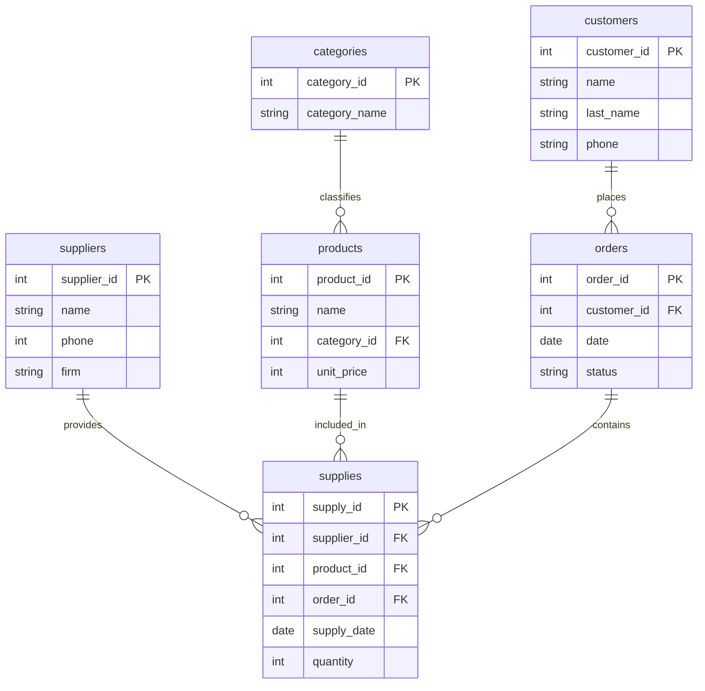

**Лабораторные работы по БД**

Перечень [лабораторные работы](https://edu.irnok.net/lib/exe/fetch.php?media=db:%D0%B2%D0%B0%D1%80%D0%B8%D0%B0%D0%BD%D1%82%D1%8B_%D0%B7%D0%B0%D0%B4%D0%B0%D0%BD%D0%B8%D0%B9_%D0%BF%D0%BE_%D1%83%D0%B4.pdf)

Telegram: [@Yebnulsya]

# Постановка задачи (Ваш вариант)

**Мясной магазин**

*Сущности:*
- customers: customer_id (PK), name, last_name, phone
- products: product_id (PK), name, category_id, unit_price
- categories: category_id (PK), category_name
- orders: order_id (PK), customer_id, date, status
- supplies: supply_id (PK), supplier_id, product_id, order_id, supply_date, quantity
- suppliers: id (PK), name, phone, firm

*Процессы:*
- Клиент создаёт заказ (orders)
- В заказ добавляются товары из supplies с количеством (quantity)
- Система фиксирует цену товара на момент покупки (в текущей схеме — unit_price из products)
- Статус заказа меняется: Новый → Подтверждён → Отправлен → Доставлен (или Отменён)

# Лабораторная работа 1 (Проектирование логической и физической модели БД)

## ER-диаграмма





Проверка нормальных форм

Первая нормальная форма (1NF): Соблюдена. Все атрибуты атомарны (неделимы), строки уникальны, каждая таблица имеет первичный ключ.

Вторая нормальная форма (2NF): Соблюдена. Все неключевые атрибуты полностью зависят от всего первичного ключа в каждой таблице. В products поле unit_price зависит от product_id.

Третья нормальная форма (3NF): Соблюдена. Транзитивные зависимости отсутствуют. Все неключевые поля зависят только от первичного ключа. В supplies поля supplier_id, product_id, order_id зависят только от supply_id.

# Лабораторная работа 2 (Создание и наполнение таблиц)
Создание таблиц
```sql
-- Таблица 'categories' (Категории)
CREATE TABLE ermakov_2271.categories (
    category_id SERIAL PRIMARY KEY,
    category_name VARCHAR(255) NOT NULL
);

-- Таблица 'customers' (Клиенты)
CREATE TABLE ermakov_2271.customers (
    customer_id SERIAL PRIMARY KEY,
    name VARCHAR(255) NOT NULL,
    last_name VARCHAR(255) NOT NULL,
    phone VARCHAR(100) UNIQUE NOT NULL
);

-- Таблица 'orders' (Заказы)
CREATE TABLE ermakov_2271.orders (
    order_id SERIAL PRIMARY KEY,
    customer_id INTEGER NOT NULL REFERENCES ermakov_2271.customers(customer_id),
    date DATE NOT NULL,
    status VARCHAR(100) NOT NULL
);

-- Таблица 'products' (Товары)
CREATE TABLE ermakov_2271.products (
    product_id SERIAL PRIMARY KEY,
    name VARCHAR(255) NOT NULL,
    category_id INTEGER NOT NULL REFERENCES ermakov_2271.categories(category_id),
    unit_price INTEGER NOT NULL CHECK (unit_price >= 0)
);

-- Таблица 'suppliers' (Поставщики)
CREATE TABLE ermakov_2271.suppliers (
    supplier_id SERIAL PRIMARY KEY,
    name VARCHAR(255) NOT NULL,
    phone VARCHAR(100) UNIQUE NOT NULL,
    firm VARCHAR(150) NOT NULL
);

-- Таблица 'supplies' (Поставки)
CREATE TABLE ermakov_2271.supplies (
    supply_id SERIAL PRIMARY KEY,
    supplier_id INTEGER NOT NULL REFERENCES ermakov_2271.suppliers(supplier_id),
    product_id INTEGER NOT NULL REFERENCES ermakov_2271.products(product_id),
    order_id INTEGER REFERENCES ermakov_2271.orders(order_id),
    supply_date DATE NOT NULL,
    quantity INTEGER NOT NULL CHECK (quantity > 0)
);
```
Заполнение таблиц
```sql
-- Заполнение таблицы 'categories'
INSERT INTO ermakov_2271.categories (category_id, category_name) VALUES
(4001, 'Говядина'),
(4002, 'Свинина'),
(4003, 'Птица'),
(4004, 'Колбасы');

-- Заполнение таблицы 'customers'
INSERT INTO ermakov_2271.customers (customer_id, name, last_name, phone) VALUES
(2001, 'Иван', 'Петров', '+79161234567'),
(2002, 'Мария', 'Сидорова', '+79167654321'),
(2003, 'Алексей', 'Кузнецов', '+79162345678'),
(2004, 'Ольга', 'Васильева', '+79163456789');

-- Заполнение таблицы 'suppliers'
INSERT INTO ermakov_2271.suppliers (supplier_id, name, phone, firm) VALUES
(1001, 'Александр Иванов', '+79031234567', 'Мясная ферма "Деревенская"'),
(1002, 'Сергей Смирнов', '+79037654321', 'Птицефабрика "Заря"'),
(1003, 'Дмитрий Попов', '+79032345678', 'Свинокомплекс "Волга"'),
(1004, 'Елена Морозова', '+79033456789', 'Колбасный цех "Традиция"');

-- Заполнение таблицы 'products'
INSERT INTO ermakov_2271.products (product_id, name, category_id, unit_price) VALUES
(5001, 'Говяжья вырезка', 4001, 850),
(5002, 'Свиная шея', 4002, 550),
(5003, 'Куриное филе', 4003, 320),
(5004, 'Сервелат', 4004, 650);

-- Заполнение таблицы 'orders'
INSERT INTO ermakov_2271.orders (order_id, customer_id, date, status) VALUES
(3001, 2001, '2024-01-15', 'Завершен'),
(3002, 2002, '2024-01-16', 'В обработке'),
(3003, 2003, '2024-01-17', 'Доставляется'),
(3004, 2004, '2024-01-18', 'Новый');

-- Заполнение таблицы 'supplies'
INSERT INTO ermakov_2271.supplies (supply_id, supplier_id, product_id, order_id, supply_date, quantity) VALUES
(6001, 1001, 5001, 3001, '2024-01-14', 50),
(6002, 1002, 5003, 3002, '2024-01-15', 100),
(6003, 1003, 5002, 3003, '2024-01-16', 70),
(6004, 1004, 5004, 3004, '2024-01-17', 30);
```
Запрос
```sql
SELECT customers.customer_id, phone, orders.order_id, status, quantity FROM ermakov_2271.customers  
INNER JOIN ermakov_2271.orders                                                                      
ON ermakov_2271.customers.customer_id = ermakov_2271.orders.customer_id
INNER JOIN ermakov_2271.supplies
ON ermakov_2271.orders.order_id =  ermakov_2271.supplies.order_id
```
# Лабораторная работа 3. Представления и процедуры
### 1.Создание представлений для выходных документов
```sql
CREATE OR REPLACE VIEW ermakov_2271.product_supplies_info AS
SELECT 
    p.name AS "Название",
    c.category_name AS "Категория", 
    p.unit_price AS "Цена за кг",
    s.quantity AS "Количество кг",
    (p.unit_price * s.quantity) AS "Стоимость поставки",
    s.supply_date AS "Дата поставки"
FROM ermakov_2271.products p
JOIN ermakov_2271.categories c ON p.category_id = c.category_id
JOIN ermakov_2271.supplies s ON p.product_id = s.product_id
ORDER BY p.name;
```
### 2.Создание процедур
```sql
 --процедура добавления продуктов
CREATE OR REPLACE PROCEDURE ermakov_2271.add_new_product(
    p_product_id INTEGER,
    p_name VARCHAR(255),
    p_category_id INTEGER, 
    p_unit_price INTEGER
)
LANGUAGE plpgsql
AS $$
DECLARE
    v_category_name VARCHAR(255);
BEGIN
    -- Проверяем существование категории
    SELECT category_name INTO v_category_name
    FROM ermakov_2271.categories 
    WHERE category_id = p_category_id;
    
    IF v_category_name IS NULL THEN
        RAISE EXCEPTION 'Категория с ID % не существует!', p_category_id;
    END IF;
    
    -- Проверяем, не существует ли уже товар с таким ID
    IF EXISTS (SELECT 1 FROM ermakov_2271.products WHERE product_id = p_product_id) THEN
        RAISE EXCEPTION 'Товар с ID % уже существует!', p_product_id;
    END IF;
    
    -- Добавляем новый товар
    INSERT INTO ermakov_2271.products (product_id, name, category_id, unit_price)
    VALUES (p_product_id, p_name, p_category_id, p_unit_price);
    
    RAISE NOTICE 'Товар "%" успешно добавлен в категорию "%"', p_name, v_category_name;
END;
$$;

-- Добавляем новые товары
CALL ermakov_2271.add_new_product(5006, 'Сервелат', 4006, 1200);
CALL ermakov_2271.add_new_product(5007, 'Печень говяжья', 4005, 450);
```
```sql
--процедура добавления в поставку
CREATE OR REPLACE PROCEDURE ermakov_2271.add_new_supply(
    p_supply_id INTEGER,
    p_supplier_id INTEGER,
    p_product_id INTEGER,
    p_order_id INTEGER,
    p_supply_date DATE,
    p_quantity INTEGER
)
LANGUAGE plpgsql
AS $$
BEGIN
    -- Проверяем существование товара
    IF NOT EXISTS (SELECT 1 FROM ermakov_2271.products WHERE product_id = p_product_id) THEN
        RAISE EXCEPTION 'Товар с ID % не существует!', p_product_id;
    END IF;
    
    -- Добавляем поставку
    INSERT INTO ermakov_2271.supplies (supply_id, supplier_id, product_id, order_id, supply_date, quantity)
    VALUES (p_supply_id, p_supplier_id, p_product_id, p_order_id, p_supply_date, p_quantity);
    
    RAISE NOTICE 'Поставка товара ID % в количестве % кг добавлена', p_product_id, p_quantity;
END;
$$;

-- Добавляем поставки для новых товаров
CALL ermakov_2271.add_new_supply(1002, 2, 5006, 2, '2025-10-16', 30);
CALL ermakov_2271.add_new_supply(1003, 3, 5007, 3, '2025-10-17', 25);
```
# 4 Лабораторная работа Анализ производительности
### 1.Создание генератора данных (20 000 записей в каждой таблице)
```sql
--Генерация для categories
INSERT INTO ermakov_2271.categories (category_id, category_name)
SELECT 
    4000 + i,
    CASE i
        WHEN 1 THEN 'Говядина'
        WHEN 2 THEN 'Свинина'
        WHEN 3 THEN 'Птица'
        WHEN 4 THEN 'Баранина'
        WHEN 5 THEN 'Субпродукты'
        WHEN 6 THEN 'Колбасы'
        WHEN 7 THEN 'Полуфабрикаты'
        WHEN 8 THEN 'Дичь'
        WHEN 9 THEN 'Морепродукты'
        WHEN 10 THEN 'Конина'
        WHEN 11 THEN 'Оленина'
        WHEN 12 THEN 'Кролик'
        WHEN 13 THEN 'Индейка'
        WHEN 14 THEN 'Утка'
        WHEN 15 THEN 'Гусь'
        WHEN 16 THEN 'Перепелка'
        WHEN 17 THEN 'Ветчина'
        WHEN 18 THEN 'Бекон'
        WHEN 19 THEN 'Сало'
        WHEN 20 THEN 'Фарши'
    END
FROM generate_series(1, 20) i;
```
```sql
--Генерация для products
INSERT INTO ermakov_2271.products (product_id, name, category_id, unit_price)
SELECT 
    5000 + i,
    CASE i
        WHEN 1 THEN 'Говяжья вырезка'
        WHEN 2 THEN 'Говяжий стейк'
        WHEN 3 THEN 'Свиная вырезка'
        WHEN 4 THEN 'Свиная корейка'
        WHEN 5 THEN 'Куриное филе'
        WHEN 6 THEN 'Куриные окорочка'
        WHEN 7 THEN 'Каре ягненка'
        WHEN 8 THEN 'Баранья лопатка'
        WHEN 9 THEN 'Печень говяжья'
        WHEN 10 THEN 'Язык говяжий'
        WHEN 11 THEN 'Колбаса докторская'
        WHEN 12 THEN 'Колбаса сырокопченая'
        WHEN 13 THEN 'Котлеты говяжьи'
        WHEN 14 THEN 'Пельмени говяжьи'
        WHEN 15 THEN 'Мясо оленя'
        WHEN 16 THEN 'Мясо фазана'
        WHEN 17 THEN 'Креветки тигровые'
        WHEN 18 THEN 'Мидии очищенные'
        WHEN 19 THEN 'Конина для бешбармака'
        WHEN 20 THEN 'Конина вырезка'
        WHEN 21 THEN 'Оленина стейк'
        WHEN 22 THEN 'Оленина для тушения'
        WHEN 23 THEN 'Кролик тушка'
        WHEN 24 THEN 'Кролик для жаркого'
        WHEN 25 THEN 'Индейка грудка'
        WHEN 26 THEN 'Индейка окорочка'
        WHEN 27 THEN 'Утка печеная'
        WHEN 28 THEN 'Утиная грудка'
        WHEN 29 THEN 'Гусь фермерский'
        WHEN 30 THEN 'Гусь для запекания'
        WHEN 31 THEN 'Перепела тушки'
        WHEN 32 THEN 'Перепелиное филе'
        WHEN 33 THEN 'Ветчина сыровяленая'
        WHEN 34 THEN 'Ветчина пармская'
        WHEN 35 THEN 'Бекон копченый'
        WHEN 36 THEN 'Бекон канадский'
        WHEN 37 THEN 'Сало соленое'
        WHEN 38 THEN 'Сало шпик'
        WHEN 39 THEN 'Фарш мясной'
        WHEN 40 THEN 'Фарш куриный'
        ELSE CASE ((i-1) % 40)
            WHEN 0 THEN 'Говяжья вырезка'
            WHEN 1 THEN 'Говяжий стейк'
            WHEN 2 THEN 'Свиная вырезка'
            WHEN 3 THEN 'Свиная корейка'
            WHEN 4 THEN 'Куриное филе'
            WHEN 5 THEN 'Куриные окорочка'
            WHEN 6 THEN 'Каре ягненка'
            WHEN 7 THEN 'Баранья лопатка'
            WHEN 8 THEN 'Печень говяжья'
            WHEN 9 THEN 'Язык говяжий'
            WHEN 10 THEN 'Колбаса докторская'
            WHEN 11 THEN 'Колбаса сырокопченая'
            WHEN 12 THEN 'Котлеты говяжьи'
            WHEN 13 THEN 'Пельмени говяжьи'
            WHEN 14 THEN 'Мясо оленя'
            WHEN 15 THEN 'Мясо фазана'
            WHEN 16 THEN 'Креветки тигровые'
            WHEN 17 THEN 'Мидии очищенные'
            WHEN 18 THEN 'Конина для бешбармака'
            WHEN 19 THEN 'Конина вырезка'
            WHEN 20 THEN 'Оленина стейк'
            WHEN 21 THEN 'Оленина для тушения'
            WHEN 22 THEN 'Кролик тушка'
            WHEN 23 THEN 'Кролик для жаркого'
            WHEN 24 THEN 'Индейка грудка'
            WHEN 25 THEN 'Индейка окорочка'
            WHEN 26 THEN 'Утка печеная'
            WHEN 27 THEN 'Утиная грудка'
            WHEN 28 THEN 'Гусь фермерский'
            WHEN 29 THEN 'Гусь для запекания'
            WHEN 30 THEN 'Перепела тушки'
            WHEN 31 THEN 'Перепелиное филе'
            WHEN 32 THEN 'Ветчина сыровяленая'
            WHEN 33 THEN 'Ветчина пармская'
            WHEN 34 THEN 'Бекон копченый'
            WHEN 35 THEN 'Бекон канадский'
            WHEN 36 THEN 'Сало соленое'
            WHEN 37 THEN 'Сало шпик'
            WHEN 38 THEN 'Фарш мясной'
            WHEN 39 THEN 'Фарш куриный'
        END
    END,
    CASE 
        WHEN i <= 40 THEN 4000 + ((i-1) / 2) + 1
        ELSE 4000 + (((i-1) % 40) / 2) + 1
    END,
    100 + ((i-1) % 401)
FROM generate_series(1, 20000) i;
```
```sql
--Генерация для suppliers
INSERT INTO ermakov_2271.suppliers (id, name, phone, firm)
SELECT 
    1000 + i AS id,
    -- Имена поставщиков
    CASE (i % 10)
        WHEN 0 THEN 'Игорь'
        WHEN 1 THEN 'Юрий'
        WHEN 2 THEN 'Виктор'
        WHEN 3 THEN 'Павел'
        WHEN 4 THEN 'Александр'
        WHEN 5 THEN 'Дмитрий'
        WHEN 6 THEN 'Сергей'
        WHEN 7 THEN 'Андрей'
        WHEN 8 THEN 'Михаил'
        WHEN 9 THEN 'Алексей'
    END AS name,
    -- Телефоны
    '+7-9' || lpad((floor(random() * 1000000000))::text, 9, '0') AS phone,
    -- Названия фирм
    'Фирма поставщик ' || i AS firm
FROM generate_series(1, 50) i;
```
```sql
--Генерация для orders
INSERT INTO ermakov_2271.orders (order_id, customer_id, date, status)
SELECT 
    3000 + i AS order_id,
    -- 500 клиентов
    2001 + ((i-1) % 500) AS customer_id,
    -- Даты за 2023 год
    DATE '2023-01-01' + ((i-1) % 365) AS date,
    -- Статусы
    CASE (i % 5)
        WHEN 0 THEN 'доставлен'
        WHEN 1 THEN 'отправлен'
        WHEN 2 THEN 'обрабатывается'
        WHEN 3 THEN 'отменен'
        WHEN 4 THEN 'в пути'
    END AS status
FROM generate_series(1, 4000) i;
```
```sql
--Генерация для customers
INSERT INTO ermakov_2271.customers (customer_id, name, last_name, phone)
SELECT 
    2000 + i AS customer_id,
    -- Имя
    CASE (i % 15)
        WHEN 0 THEN 'Иван'
        WHEN 1 THEN 'Петр'
        WHEN 2 THEN 'Сергей'
        WHEN 3 THEN 'Алексей'
        WHEN 4 THEN 'Дмитрий'
        WHEN 5 THEN 'Андрей'
        WHEN 6 THEN 'Михаил'
        WHEN 7 THEN 'Олег'
        WHEN 8 THEN 'Николай'
        WHEN 9 THEN 'Владимир'
        WHEN 10 THEN 'Елена'
        WHEN 11 THEN 'Анна'
        WHEN 12 THEN 'Мария'
        WHEN 13 THEN 'Ольга'
        WHEN 14 THEN 'Наталья'
    END AS name,
    -- Фамилия
    CASE (i % 20)
        WHEN 0 THEN 'Иванов'
        WHEN 1 THEN 'Петров'
        WHEN 2 THEN 'Сидоров'
        WHEN 3 THEN 'Смирнов'
        WHEN 4 THEN 'Кузнецов'
        WHEN 5 THEN 'Попов'
        WHEN 6 THEN 'Васильев'
        WHEN 7 THEN 'Павлов'
        WHEN 8 THEN 'Семенов'
        WHEN 9 THEN 'Голубев'
        WHEN 10 THEN 'Виноградов'
        WHEN 11 THEN 'Богданов'
        WHEN 12 THEN 'Воробьев'
        WHEN 13 THEN 'Федоров'
        WHEN 14 THEN 'Михайлов'
        WHEN 15 THEN 'Беляев'
        WHEN 16 THEN 'Тарасов'
        WHEN 17 THEN 'Белов'
        WHEN 18 THEN 'Комаров'
        WHEN 19 THEN 'Орлов'
    END AS last_name,
    -- Телефон
    '+7-9' || lpad(((i * 1234567) % 1000000000)::text, 9, '0') AS phone
FROM generate_series(1, 500) i;
```
### 2.Анализ плана выполения 
```sql
EXPLAIN (ANALYZE, BUFFERS)
SELECT 
    o.order_id,
    c.name AS "Имя клиента",
    c.last_name AS "Фамилия",
    o.date AS "Дата заказа",
    o.status AS "Статус"
FROM ermakov_2271.orders o
JOIN ermakov_2271.customers c ON c.customer_id = o.customer_id
WHERE o.date BETWEEN '2023-01-01' AND '2023-06-30'
    AND o.status IN ('доставлен', 'в пути')
ORDER BY o.date ASC
LIMIT 100;
```
### 3.Создание индексов для оптимизации
```sql
CREATE INDEX idx_orders_filter ON ermakov_2271.orders 
    (date, status) INCLUDE (customer_id, order_id);
DROP INDEX IF EXISTS ermakov_2271.idx_orders_filter;
```
# 5 лабораторная работа риггеры и аудит
### 1.Создание таблицы-журнала для отслеживания изменений
```sql
CREATE TABLE IF NOT EXISTS ermakov_2271.audit_log
(
    log_id SERIAL PRIMARY KEY,
    table_name TEXT,
    operation TEXT,
    old_data JSONB,
    new_data JSONB,
    changed_at TIMESTAMP DEFAULT CURRENT_TIMESTAMP
);
```
### 2.Функция аудита
```sql
CREATE OR REPLACE FUNCTION ermakov_2271.audit_function()
RETURNS TRIGGER AS $$
BEGIN
    IF TG_OP = 'INSERT' THEN
        INSERT INTO ermakov_2271.audit_log(table_name, operation, new_data)
        VALUES (TG_TABLE_NAME, TG_OP, to_jsonb(NEW));
        RETURN NEW;
    ELSIF TG_OP = 'UPDATE' THEN
        INSERT INTO ermakov_2271.audit_log(table_name, operation, old_data, new_data)
        VALUES (TG_TABLE_NAME, TG_OP, to_jsonb(OLD), to_jsonb(NEW));
        RETURN NEW;
    ELSIF TG_OP = 'DELETE' THEN
        INSERT INTO ermakov_2271.audit_log(table_name, operation, old_data)
        VALUES (TG_TABLE_NAME, TG_OP, to_jsonb(OLD));
        RETURN OLD;
    END IF;
END;
$$ LANGUAGE plpgsql;
```
### 3.Триггеры аудита для всех таблиц
```sql
DO $$
BEGIN
    IF NOT EXISTS (
        SELECT 1 FROM pg_trigger WHERE tgname = 'audit_categories_changes'
    ) THEN
        CREATE TRIGGER audit_categories_changes
        AFTER INSERT OR UPDATE OR DELETE ON ermakov_2271.categories
        FOR EACH ROW EXECUTE FUNCTION ermakov_2271.audit_function();
    END IF;
    
    IF NOT EXISTS (
        SELECT 1 FROM pg_trigger WHERE tgname = 'audit_customers_changes'
    ) THEN
        CREATE TRIGGER audit_customers_changes
        AFTER INSERT OR UPDATE OR DELETE ON ermakov_2271.customers
        FOR EACH ROW EXECUTE FUNCTION ermakov_2271.audit_function();
    END IF;

    IF NOT EXISTS (
        SELECT 1 FROM pg_trigger WHERE tgname = 'audit_orders_changes'
    ) THEN
        CREATE TRIGGER audit_orders_changes
        AFTER INSERT OR UPDATE OR DELETE ON ermakov_2271.orders
        FOR EACH ROW EXECUTE FUNCTION ermakov_2271.audit_function();
    END IF;

    IF NOT EXISTS (
        SELECT 1 FROM pg_trigger WHERE tgname = 'audit_products_changes'
    ) THEN
        CREATE TRIGGER audit_products_changes
        AFTER INSERT OR UPDATE OR DELETE ON ermakov_2271.products
        FOR EACH ROW EXECUTE FUNCTION ermakov_2271.audit_function();
    END IF;

    IF NOT EXISTS (
        SELECT 1 FROM pg_trigger WHERE tgname = 'audit_suppliers_changes'
    ) THEN
        CREATE TRIGGER audit_suppliers_changes
        AFTER INSERT OR UPDATE OR DELETE ON ermakov_2271.suppliers
        FOR EACH ROW EXECUTE FUNCTION ermakov_2271.audit_function();
    END IF;

    IF NOT EXISTS (
        SELECT 1 FROM pg_trigger WHERE tgname = 'audit_supplies_changes'
    ) THEN
        CREATE TRIGGER audit_supplies_changes
        AFTER INSERT OR UPDATE OR DELETE ON ermakov_2271.supplies
        FOR EACH ROW EXECUTE FUNCTION ermakov_2271.audit_function();
    END IF;
END $$;
```
### 4. Функции каскадного удаления
```sql
CREATE OR REPLACE FUNCTION ermakov_2271.delete_orders_by_customer()
RETURNS TRIGGER AS $$
BEGIN
    DELETE FROM ermakov_2271.orders WHERE customer_id = OLD.customer_id;
    RETURN OLD;
END;
$$ LANGUAGE plpgsql;

CREATE OR REPLACE FUNCTION ermakov_2271.delete_supplies_by_order()
RETURNS TRIGGER AS $$
BEGIN
    DELETE FROM ermakov_2271.supplies WHERE order_id = OLD.order_id;
    RETURN OLD;
END;
$$ LANGUAGE plpgsql;

CREATE OR REPLACE FUNCTION ermakov_2271.delete_supplies_by_supplier()
RETURNS TRIGGER AS $$
BEGIN
    DELETE FROM ermakov_2271.supplies WHERE supplier_id = OLD.id;
    RETURN OLD;
END;
$$ LANGUAGE plpgsql;

CREATE OR REPLACE FUNCTION ermakov_2271.delete_products_by_category()
RETURNS TRIGGER AS $$
BEGIN
    DELETE FROM ermakov_2271.products WHERE category_id = OLD.category_id;
    RETURN OLD;
END;
$$ LANGUAGE plpgsql;

CREATE OR REPLACE FUNCTION ermakov_2271.delete_supplies_by_product()
RETURNS TRIGGER AS $$
BEGIN
    DELETE FROM ermakov_2271.supplies WHERE product_id = OLD.product_id;
    RETURN OLD;
END;
$$ LANGUAGE plpgsql;
```
### 5. Триггеры каскадного удаления
```sql
DROP TRIGGER IF EXISTS trg_delete_orders_by_customer ON ermakov_2271.customers;
CREATE TRIGGER trg_delete_orders_by_customer
BEFORE DELETE ON ermakov_2271.customers
FOR EACH ROW
EXECUTE FUNCTION ermakov_2271.delete_orders_by_customer();

DROP TRIGGER IF EXISTS trg_delete_supplies_by_order ON ermakov_2271.orders;
CREATE TRIGGER trg_delete_supplies_by_order
BEFORE DELETE ON ermakov_2271.orders
FOR EACH ROW
EXECUTE FUNCTION ermakov_2271.delete_supplies_by_order();

DROP TRIGGER IF EXISTS trg_delete_supplies_by_supplier ON ermakov_2271.suppliers;
CREATE TRIGGER trg_delete_supplies_by_supplier
BEFORE DELETE ON ermakov_2271.suppliers
FOR EACH ROW
EXECUTE FUNCTION ermakov_2271.delete_supplies_by_supplier();

DROP TRIGGER IF EXISTS trg_delete_products_by_category ON ermakov_2271.categories;
CREATE TRIGGER trg_delete_products_by_category
BEFORE DELETE ON ermakov_2271.categories
FOR EACH ROW
EXECUTE FUNCTION ermakov_2271.delete_products_by_category();

DROP TRIGGER IF EXISTS trg_delete_supplies_by_product ON ermakov_2271.products;
CREATE TRIGGER trg_delete_supplies_by_product
BEFORE DELETE ON ermakov_2271.products
FOR EACH ROW
EXECUTE FUNCTION ermakov_2271.delete_supplies_by_product();
```
### 6. Проверка
```sql
DELETE FROM ermakov_2271.customers WHERE customer_id = 2002;

INSERT INTO ermakov_2271.categories (category_name)
VALUES ('Тестовая категория');

UPDATE ermakov_2271.customers
SET phone = '+79990000099'
WHERE customer_id = 1;
```
